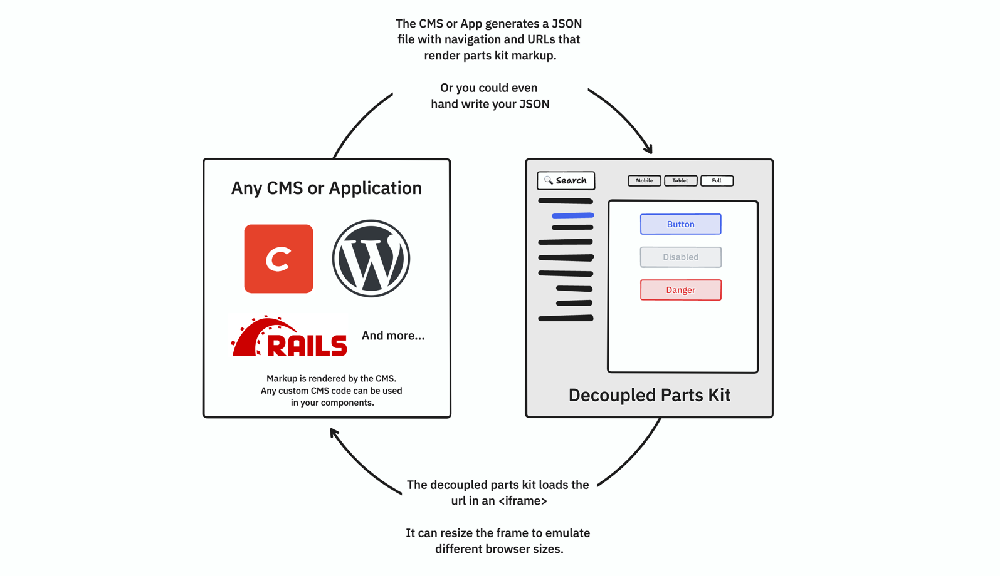

# Decoupled Parts Kit proof of concept

**Table of Contents**

- [Use on your project](#use-on-your-project)
- [Key Concepts](#key-concepts)
- [Contribute to this project](#contribute-to-this-project)

This is a proof of concept for a decoupled/build-free/headless parts kit (still trying to figure out what to call it).

What does that mean exactly?

There are two sides to this idea. First, your app is responsible for rendering components in your template language of choice. Second, the parts kit provides the UI to view those components in a "Storybook-esque" experience. No additional tooling or build steps required.

Storybook is awesome! But... it doesn't have first-party support for Twig, ERB or other template formats that CMS and application frameworks commonly use.

While third-party plugins do exist, they often adds [extra layers of abstraction](https://wingsuit-designsystem.github.io/), or use a [JavaScript template renderer](https://github.com/markhuot/storybook-twig) that isn't a 1:1 match to the actual PHP or Ruby app.

While all of these tools are awesome and are well suited for certain projects, this parts kit takes things in a different direction:

- **No build tools needed** - Paste a CDN hosted script, write a JSON file. Your CMS or App handles component rendering.
- **Low abstraction** - The parts kit uses standard web concepts (script files, JSON, web components, etc). It should be possible to get a basic parts kit up and running without boilerplate.
- **One to one rendering between parts and app** - Because your app is rendering these components, you can be confident that you are testing the same component and features that you're using in your app.

## Use on your project!

All it takes is two lines to have a decoupled parts kit in your project.

Include the CDN hosted script and configure the `<parts-kit>` custom element with the URL to your [Config JSON](#the-config-json-file) file.

In the future, we'll have CMS plugins that automatically setup and configure of your parts kit.

```html
<script type="module" src="https://unpkg.com/@viget/parts-kit@^0/lib/parts-kit.js"></script>
<parts-kit config-url="YOUR-URL-HERE"></parts-kit>
```

## Key Concepts



#### The Config JSON file

The config JSON file contains a nested tree of pages and other config options that could arise.

You could either write this JSON by hand, or your CMS of choice could have a plugin created to create this JSON on the fly.

```json
{
  "schemaVersion": "0.0.1",
  "nav": [
    {
      "title": "Buttons",
      "children": [
        {
          "title": "Primary",
          "url": "/parts-kit/button/primary"
        },
        {
          "title": "Disabled",
          "url": "/parts-kit/button/disabled"
        }
      ]
    },
    {
      "title": "Cards",
      "children": [
        {
          "title": "Basic Card",
          "url": "/parts-kit/cards/basic"
        }
      ]
    }
  ]
}
```

#### CMS or App Rendered Components

The CMS or App renders the content. All it needs to do is provide urls for each part. These URLS render the CSS, JS and Markup for a part.

It is optional for a CMS to generate a Navigation JSON file. But for commonly used platforms, it would make sense to automate this.

#### Parts Kit

The parts kit reads the Navigation JSON file and creates a nav.

When a nav item is clicked, an `<iframe>` in the parts kit loads the URLs listed in the Nav file.

The `<iframe>` isolates projects styles and scripts from the parts kits. It also makes it easy to emulate screen sizes and test the responsive behaviors of your components.

## Possible Features

### Parts Kit

**Required**

- Loads a JSON file that builds the parts kit navigation.
- On clicking a nav item Loads the part URL within an `<iframe>`

**Optional**

- URLS are updated, so you can link to a specific part
- Screen size emulation
- Multiple frame sizes at once (like [Responsively](/Users/joshuapease/Development/_internal/parts-kit/README.md))
- Editable text / images with JavaScript that inserts `contenteditable` attributes .
- Can parse the URL that the CMS provides and pull out copy/pastable snippets.
- If the CMS provides a .md file, will render and style the documentation
- Expanding a nav item auto-selects the first child with a URL
- 3+ levels of navigation.

```
Styles
- Colors
-- Colors
- Typography
-- Headings
-- Rich Text

Components
- Buttons
-- Primary
-- Secondary
```

### CMS Plugin

**Required**

- Provides a URL to render individual parts.

**Optional**

- Generates JSON for the parts kit navigation.
- Provides a `/parts-kit` url that inserts loads JavaScript for parts kit.
- Automatically inserts any JavaScript for turning on `contenteditable` or copy/paste of snippets.
- Helpers for dummy text and images (some of this already exists in `craft-viget-base`)

# Contribute to this project

## Deploy

Right now the demo is deployed to github pages. It's a manual process that uses the [gh-pages](https://github.com/tschaub/gh-pages) npm package.

- Check out the `main` branch
- Call `npm run deploy`
